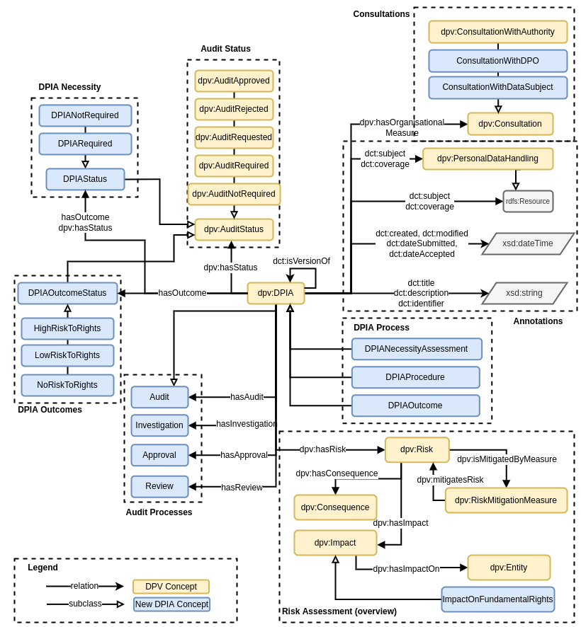

# DPIA Extension for Data Privacy Vocabulary (DPV-DPIA)

Author: Harshvardhan J. Pandit

See [repo](https://github.com/coolharsh55/dpv-dpia) and [draft article](https://harshp.com/dpv-dpia/paper/paper.html)  about this work

## DPIA

DPV provides the `dpv:DPIA` concept, but does not further distinguish between (1) necessity to conduct a DPIA; (2) conducting a DPIA; and (3) recording the outcomes of a DPIA. For these, the following concepts are proposed: `DPIANecessityAssessment`, `DPIAProcedure`, and `DPIAOutcome`.



## Annotations

For describing the what/where/how/when type annotations associated with DPIA (and its parts), [DCMI terms](https://dublincore.org/specifications/dublin-core/dcmi-terms/) are reused as follows:

* `dct:title`: title of the DPIA
* `dct:creator`: creator of DPIA
* `dct:description`: description of the DPIA
* `dct:identifier`: an identifier for the DPIA, could be a unique reference and/or a version
* `dct:created`: date the DPIA was created or generated
* `dct:modified`: date DPIA was modified
* `dct:dateSubmitted`: date the DPIA was submitted (e.g. for audit or approval)
* `dct:dateAccepted`: date the DPIA was accepted (e.g. after assessment)
* `dct:temporal`: other temporal information as needed 
* `dct:valid`: denotes duration for how long the DPIA would be valid or in effect, or could be a reference to when to conduct a DPIA again
* `dct:conformsTo`: whether the DPIA follows some guidelines or conforms to a code of conduct or a template/methodology/standard
* `dct:isVersionOf`: reference to prior version of this DPIA
* `dct:subject`: references the 'topic' of the DPIA, i.e. what is being assessed, e.g. a product or a specific service. This would typically be a `dpv:PersonalDataHandling` or its subclass within DPV, but common use could also be as a string description
* `dct:coverage`: indicating the scope of the DPIA, e.g. temporal or geographical or jurisdictional

## DPIA Outcomes

The three parts of a DPIA (necessity, procedure, outcome) are separate in terms of what their outcomes can be and need to be documented. For this, the concept `dpv:DPIA` should be a subclass of `Audit` representing any investigation or assessment or audit. This permits reuse of `dpv:hasStatus dpv:AuditStatus` to indicate the status of any audit, in this case for DPIAs. 

```
| Status ↓ DPIA →  | DPIANecessityAssessment | DPIAProcedure   | DPIAOutcome         |
|------------------|-------------------------|-----------------|---------------------|
| AuditRequired    | Check DPIA needed       | DPIA needed     | Outcome pending     |
| AuditAccepted    | Correct analysis        | DPIA accepted   | Outcome accepted    |
| AuditRefused     | Wrong analysis          | Incorrect DPIA  | Wrong analysis      |
| AuditApproved    | Approved analysis       | DPIA approved   | Outcome approved    |
| AuditRequested   | Request Checking        | DPIA requested  | Analysis requested  |
| AuditNotRequired | DPIA check not needed   | DPIA not needed | Analysis not needed |
```

The `dpv:AuditStatus` only represents the overall status of that process/event/concept - so it will only inform whether someone needs to be done or has been done. In DPIAs, it is also necessary to record the *outcome* of each part, i.e. what was determined after the necessity assessment would specify whether a DPIA is needed to be conducted, and so on. To represent this information, a new property `dpv:hasOutcome` is proposed for addition in to DPV.

Specific outcomes of each process are:

* for `dpv:DPIANecessityAssessment`: the concept `DPIANecessityStatus` with specialisations `DPIARequired` and `DPIANotRequired`
* for `dpv:DPIAProcedure`: the concept `DPIARiskStatus` with specialisations  `HighRiskToRights`, `LowRiskToRights`, `NoRiskToRights`
* for `dpv:DPIAOutcome`: the concept `DPIAOutcomeStatus` with specialisations `HighResidualRisk`, `ConsultationRequired`, `MitigatedRisk`

In these, all these *statuses* can also be used as annotations for other concepts, such as specific instances of `dpv:PersonalDataHandling`, or `dpv:Technology` to indicate their relation and relevance in terms of  DPIAs.

Similar to `Audit`, other relevant processes that are involved in a DPIA but can be generalised include: `Approval`, `Investigation`, and `Review`. These concepts can be relevant as organisational measures, for example to specify there is a reviewing procedure or policy in place for processing activities.
For representing various consultations, DPV provides the `dpv:Consultation` concept. For DPIAs, this needs to be extended as: `ConsultationWithDataSubject` and `ConsultationWithDPO`.

## Risk Assessment

For expressing risks, mitigations, and impacts, DPV provides high-level concepts as:

* to indicate risks `dpv:Risk`, `dpv:hasRisk`
* mitigations `dpv:RiskMitigationMeasure`, `dpv:mitigatesRisk`
* consequences `dpv:Consequence`, `dpv:hasConsequence`, `ExclusionOfDataSubjects`, `DiscriminationOfDataSubjects`
* impacts `dpv:Impact`, `dpv:hasImpact`, `dpv:hasImpactOn`

For more specific risk assessment information, such as risk levels and severity, there is ongoing work on a ISO 31000 (series) based [risk ontology](https://github.com/coolharsh55/riskonto) 

Specific risk related concepts that are relevant here:

* risks: illegitimate access, undesired modification, disappearance of data
* impacts: Prevents exercise of right, Prevents access to service, Prevents entry into contract, Prevents using a contract

## Scale and Scope

*Scale* and *Scope* are important concepts for consideration of risks and impacts in a DPIA. However, they are also relevant in other processes, such as other impact assessments, management of data and technologies, and so on. Therefore, these concepts should be provided as part of the main DPV vocabulary.

`Scale` refers to a measurement along some dimension (of another concept). While there can be absolute values for scale (e.g. 9001 as a number), qualitative labels are more common in DPIAs and other avenues. For this reason, some qualitative concepts would be useful to be provided as part of DPV. The proposal is to have these concepts, in order of larger scale to smaller: `Massive`, `Huge`, `Large`, `Medium`, `Small`, `Sporadic`, `Singular`.

Specific scales relevant in a DPIA include: personal data (`DataVolume`), data subjects (`DataSubjectScale`), and processing areas (`GeographicScale`). The property `hasScale` is needed to associate these as a context of activities, and therefore as a sub-property of `hasContext`. Each type of scale is specialised with the qualifiers (list above) to provide a convenient ability to refer to that concept, e.g. *large scale of data subjects*.

```
|          | DataVolume         | DataSubjectScale            | GeographicScale         |
| -------- | ------------------ | --------------------------- | ----------------------- |
| Massive  | MassiveDataVolume  | MassiveScaleOfDataSubjects  | MassiveGeographicScale  |
| Huge     | HugeDataVolume     | HugeScaleOfDataSubjects     | HugeGeographicScale     |
| Large    | LargeDataVolume    | LargeScaleOfDataSubjects    | LargeGeographicScale    |
| Medium   | MediumDataVolume   | MediumScaleOfDataSubjects   | MediumGeographicScale   |
| Small    | SmallDataVolume    | SmallScaleOfDataSubjects    | SmallGeographicScale    |
| Sporadic | SporadicDataVolume | SporadicScaleOfDataSubjects | SporadicGeographicScale |
| Singular | SingularDataVolume | SingularScaleOfDataSubjects | SingularGeographicScale |
```

A better alternative for `GeographicScale` would be to express coverage in terms of locations, as: `Global`, `NearlyGlobal`, `MultiNational`, `National`, `Regional`, `Locality`, `WithinEnvironment`. This is much clearer in terms of what the scale is as compared to labels like *large* and *massive* which are context dependant. Either can be provided, or even both can be provided. If both are to be provided, then `GeographicCoverage` could be a subclass of `GeographicScale` and the parent concept for these coverage concepts.

*Scope*, in differentiating it from *Scale*, is defined as the *variance* of something i.e. how much of something is present or how different it is or what is included and what is not. Scale is more about *measurement* of something. Scope can include things such as specific data categories, or groups of data subjects, or areas - which would not be accurate to specify as being the *scale* of something. Therefore, the concept `Scope` and property `hasScope` are necessary to express this. Further specialisation is not advised as scope can vary (wildly at times) depending on what the use-case is.

There are existing concepts within DPV which fall under the category of *Scale*. These include `dpv:Frequency`, to be provided with the qualifiers or specialisations as `Continous`, `Often`, `Sporadic`, `Singular`; and `dpv:Duration` to be provided with qualifiers `Endless`, `TemporalDuration`, `UntilEvent`, `UntilTime`, `FixedOccurences`. Both of these sets describe how these terms are used and providing them would be beneficial for representing information. Note that while frequency terms are consistent with describing *scale*, those from duration are not homogenous and describe different types of information. This is intentional as duration can be temporal, event-base, or iteration-based. Providing them all under *scale* despite this would be a good design choice for consistency with other similar concepts.

## Justification as a concept

In DPIA documents, a large amount of information is expected to be recorded in the form of *justifications* for why something was or was not done regarding the requirements set out by GDPR or DPAs. This information would typically be indicated as a textual description (i.e. free-form text) accompanying some question or concept. Given the importance of this concept in legal compliance, and the necessity to record this information in a form more explicit than (mere) descriptions, the property `hasJustification` and concept `Justification` is proposed for inclusion in DPV. The concept enables associating a textual statement, or document, or specific concept as the justification for its state or existence, and is also useful beyond DPIAs - such as for acknowledging legal compliance obligations or recording a DPO’s statements during an investigation.

## Additional concepts extending existing taxonomies

For `dpv:Processing` with parent concept in brackets.

* `Access`  (`dpv:Use`)
* `Assess` (`dpv:Use`)
* `Filter` (`dpv:Transform`)
* `Monitor` (`dpv:Consult`)
* `Modify`  (`dpv:Alter`)
* `Observe` (`dpv:Obtain`)
* `Screen` (`dpv:Transform`)

For `dpv:DataSubject`:

* `MentallyVulernable`
* `AsylumSeeker`
* `ElderlyDataSubject`

For `dpv:TechnicalOrganisationalMeasure`:

* `CredentialManagement` (`dpv:AuthorisationProcedure`)
* `DataBackupProtocols` (`dpv:TechnicalMeasure`)
* `PhysicalAccessControlMethod` (`dpv:AccessControlMethod`)
* 

For `dpv:Technologoy`:

* `ConventionalTechnology`
*  `NewTechnologoy`

For `dpv:ProcessingContext`:

* `AutomationOfProcessing`
* `FullyAutomatedProcessing`
* `AutomatedProcessingWithHumanVerification`
* `AutomatedProcessingWithHumanOversight`
* `AutomatedProcessingWithHumanInput`
* `PartiallyAutomatedProcessing`
* `CompletelyManualProcessing`

For `dpv:Purpose`:

* `MaintainCreditCheckingDatabase` (`dpv:CreditChecking`)
* `MaintainCreditRatingDatabase` (`dpv:CreditChecking`)
* `MaintainFraudDatabase` (`dpv:FraudPreventionAndDetection`)

For `dpv:PersonalData` in DPV-PD:

* `PerformanceAtWork` (`dpv-pd:Behavioral,dpv-pd:Professional`)
* `FinancialStatus` (`dpv-pd:Financial`)
* `Reliability` (`dpv-pd:Behavioral`)
* `Profile` (`dpv:PersonalData`)
* `WorkEnvironment` (`dpv-pd:Professional`)
* `BrowserHistory` (`dpv-pd:BrowsingBehavior`)
* `VehicleLicense` (`dpv-pd:Identifying`)
* `VehicalLicenseNumber` (`VehicleLicense`)
* `VehicalLicenseRegistration` (`VehicleLicense`)
* `FacialPrint` (`dpv-pd:Biometric`)
* `PersonalDocuments` (`dpv-pd:External`)
* `HouseholdData` (`dpv:PersonalData`)
* `SocialMediaData` (`dpv-pd:Communication`) with existing categories under this
 * `PubliclyAvailableSocialMediaData` (`SocialMediaData`)
 
## Acknowledgements
 
**Funding:** This work has been funded by Irish Research Council  Government of Ireland Postdoctoral Fellowship Grant\#GOIPD/2020/790.
The ADAPT SFI Centre for Digital Media Technology is funded by Science
Foundation Ireland through the SFI Research Centres Programme and is co-funded
under the European Regional Development Fund (ERDF) through Grant\#13/RC/2106\_P2.

**Contributions:** Thanks to Rana Saniei for early discussions relevant to concepts regarding DPIAs, Delaram Golpayegani for discussions related to ISO risk management, and Georg P. Krog for analysis of DPIA requirements and identification of missing DPV concepts. These contributors would be attributed for relevant concepts in above list.
